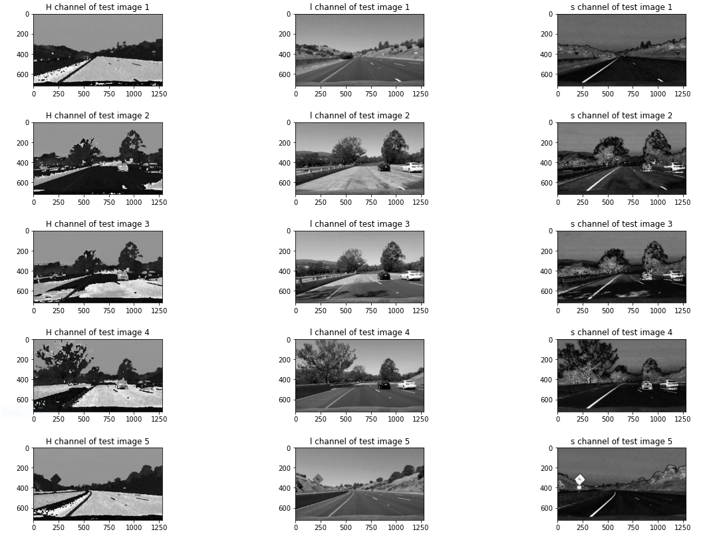
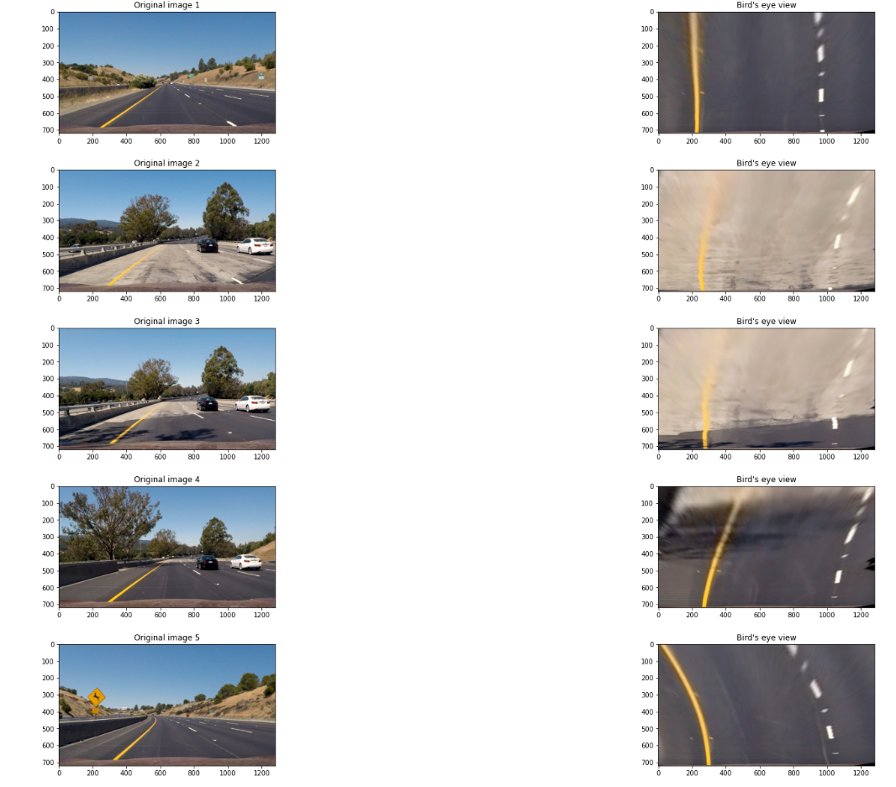
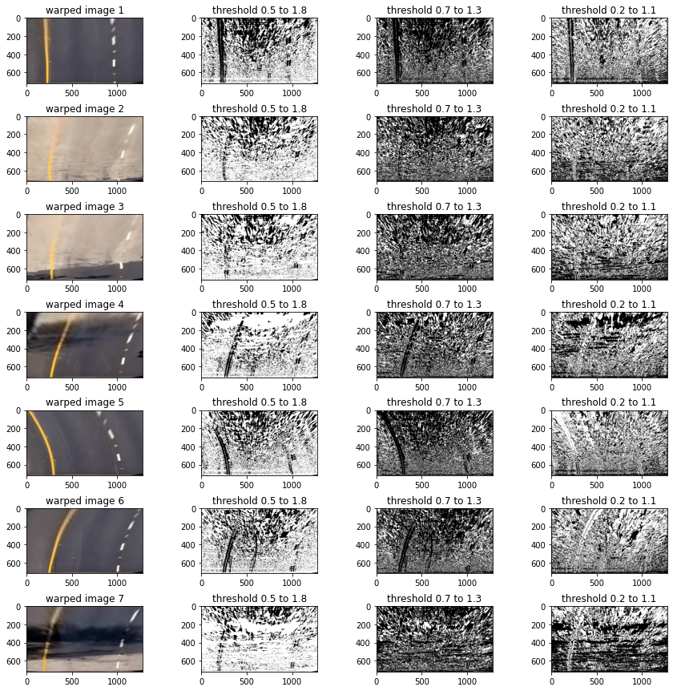

# Perception-Stack-for-Self-Driving-Cars
In this project we are going to create a simple perception stack for self-driving cars (SDCs.) Although a typical perception stack for a self-driving car may contain different data sources from different sensors (ex.: cameras, lidar, radar, etc...), we’re only going to be focusing on video streams from cameras for simplicity. We’re mainly going to be analyzing the road ahead, detecting the lane lines, detecting other cars/agents on the road, and estimating some useful information that may help other SDCs stacks. The project is split into two phases. We’ll be going into each of them in the following parts.

## Phase 1 - Lane Line detection:
In any driving scenario, lane lines are an essential component of indicating traffic flow and where a vehicle should drive. It's also a good starting point when developing a self-driving car!The lane detection system was written in Python using the OpenCV library. Here's the current image processing pipeline:
1) Distortion Correction
2) Perspective Warp
3) Filteration to get the binary image
4) Histogram Peak Detection
5) Sliding Window Search
6) Curve Fitting
7) Overlay Detected Lane
8) Apply to Video

## Distortion Correction
Camera lenses distort incoming light to focus it on the camera sensor. Although this is very useful in allowing us to capture images of our environment, they often end up distorting light slightly inaccurately. This can result in inaccurate measurements in computer vision applications. However, we can easily correct this distortion.

How would you do this? You can calibrate your image against a known object, and generate a distortion model which accounts for lens distortions. This object is often an asymmetric checkerboard, similar to the below Images:
### Why is the checkerboard pattern so widely used in calibration?
Checkerboard patterns are distinct and easy to detect in an image. Not only that, the corners of squares on the checkerboard are ideal for localizing them because they have sharp gradients in two directions. In addition, these corners are also related by the fact that they are at the intersection of checkerboard lines. All these facts are used to robustly locate the corners of the squares in a checkerboard pattern.


## Camera Calibration
Camera Calibration is a necessary step before processing Images taken by the camera. Every Camera has some irregularities and tend to distort images to some extent. This can be due to the uneven curvature, material of lens, environment irregularities etc.

So after loading the images we calibrate the camera with them. Open CV provides some handy functions like findChessboardCorners and calibrateCamera to help us do this.  
  ```
  Original and calibrated images
  ```


### Briefly state how you computed the camera matrix and distortion coefficients. Provide an example of a distortion corrected calibration image.

To calibrate the camera, First of all we imported the chessboard Images, and found their corners using the findChessboardCorners method. We also initialized the obj point as objp

We kept finding corners and appended them to an array imgpoints and obj point to an array objpoints. Then We provided these as input to the calibrateCamera method, which returned a matrix. This matrix can now be used to undistort any image using the undistort method of OpenCV. This code is written in the cell 4 of my python notebook.
Undistortion

In cell 6 We used the same matrix to undistort some test Images too These are some Images after Distortion Correction.

## Color space conversion
In this step,We are seeking to get rid of the shadow and brightness of the sun and get the appropriate color channel (with good info about lane edges).

from the visualization,We deduced that the appropriate channel for our project is the ***S-channel***.
## Transformation warp
For being hard to detect curved lines in this space so we need to transform the images by the prespective transformatin which enables us to look at them from bird eye view. 

To do this task first We tried several points to be source points (from the original images) and decided their corresponding points at the output
then we chose the good set for our case. at the end We used OpenCV methods to do this transformation 
.

## Experiment Different Colors Channel
We tried converting the Image to various color spaces for detecting the lane lines better. We tried RGB, HSV, HLS, Lab and YCrCb color spaces.


Now, we are able to identify the lane lines easily, which are too bright to identify in the original image itself. We have tried those color channels for combining they were easily able to detect the lane lines and were almost free from noise.
## Sobel X and Y
We experimented on Sobel operator to check if it helps in identifying the lane lines. These are some examples of Sobel x applied on the warped images

If Images are not properly warped, the left lane line is completely getting misidentified. Sobel identifies road edge as the lane line. This is due to the low contrast between lane line and the bright road in these two images. However this gets better after removing the road edge from the warped picture.

## Sobel Magnitude
These are some pictures of experimentation on the warped Images using sobel magnitude

```
We can't see any improvement in lane detection using sobel magnitude also. 
Sobel is not able to detect low contrast lane lines and hence will might 
fail in bright road conditions.
```
## Sobel Gradient
These are some images of experimentation using sobel gradient. We tried to filter out some noise using the arctan operator to reduce the near horizontal lines from the Image, however this introduced a lot of noise of its own.

```
Gradient sobel in itself doesn't looks good enough to detect lane lines.
Also there is lot of noise in the images. We'll further try to combine the sobel 
techniques along with the color channels to detect lane lines better and to suppress
the detection of road edges in bright as well as dark conditions.
```
## Combining Channels
We tried combining sobel techniques and channel thresholds to get the binary image of detected lanes but finally deduced that lanes get detected best using the color channels and hence went with channel thresholding for lane detection.


## Histogram Peak Detection
We'll be applying a special algorithm called the Sliding Window Algorithm to detect our lane lines. However, before we can apply it, we need to determine a good starting point for the algorithm. It works well if it starts out in a spot where there are lane pixels present, but how can we detect the location of these lane pixels in the first place? It's actually really simple!

We'll be getting a histogram of the image with respect to the X axis. Each portion of the histogram below displays how many white pixels are in each column of the image. We then take the highest peaks of each side of the image, one for each lane line. Here's what the histogram looks like:


## Sliding Window Search and Fitting the Curve with Green Line
## Draw Lane
## Calculating The Distance of the Car from Center and its Direction
Now we are going to calculate the center of the lane to find the distance of the car relative to the lane center.
First we will get the initial left lane position and the initial right lane position by subtitiude in the following polynomial equation 


by averging the outputs from this equation we will find the center of lane. with assumption that the center of the car is half of the image width we can calculate the diffenernce between the car center and lane center.
For direction we can implement simple function check if the distance between the center of the lane and the center of the car is greater than 0,the car will be at the right of the lane else it will be at the left of it.

## Calculating Radius of Curvature
## The Final Image

## Problems faced during the project
There were a lot of challenges in the project. We have enlisted some of them with the solutions.

1) Too much Noise (Lightening & Shadow): We experimented on various color channels and selected the ones with the least noise.
2) Curvature of the lane: We solved it by Eye Bird View
3) Lane Detection: We solve it by Sliding Window
4) Radius, Position, lane values changing frequently: We applied averaging/smoothening over past few frames using queues to suppress the sudden changes in values.


## PipeLine(video)

Please find the link to the output video:
# Links
[Project video-input](https://github.com/Mayar-ElMallah/Perception-Stack-for-Self-Driving-Cars/blob/29ac2f3257e433c54d1b2b2be1b6e30ff1e9b7b1/project_video.mp4)            /           [Project video-output](https://github.com/Mayar-ElMallah/Perception-Stack-for-Self-Driving-Cars/blob/29ac2f3257e433c54d1b2b2be1b6e30ff1e9b7b1/project_video_output.mp4)


[Challenge video-input](https://github.com/Mayar-ElMallah/Perception-Stack-for-Self-Driving-Cars/blob/29ac2f3257e433c54d1b2b2be1b6e30ff1e9b7b1/challenge_video.mp4)         /         [Challenge video-output](https://github.com/Mayar-ElMallah/Perception-Stack-for-Self-Driving-Cars/blob/29ac2f3257e433c54d1b2b2be1b6e30ff1e9b7b1/challenge_video_output2.mp4)


[Harder challenge video-input](https://github.com/Mayar-ElMallah/Perception-Stack-for-Self-Driving-Cars/blob/29ac2f3257e433c54d1b2b2be1b6e30ff1e9b7b1/harder_challenge_video.mp4)   /  [Harder challenge video-output](https://github.com/Mayar-ElMallah/Perception-Stack-for-Self-Driving-Cars/blob/29ac2f3257e433c54d1b2b2be1b6e30ff1e9b7b1/project_video_output3.mp4)


